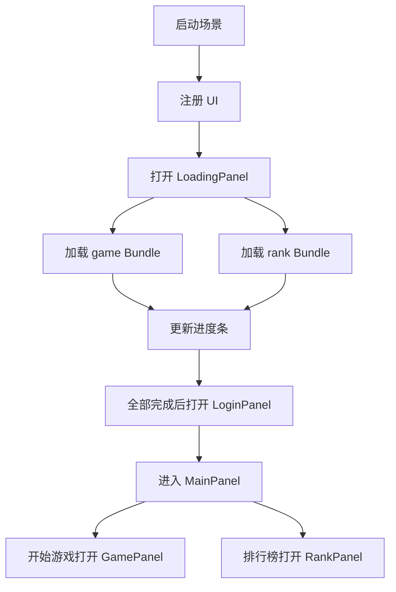

# 小游戏业务分包实施方案

## 目标

本次分包目标是把当前集中在 `resources` 中的业务资源拆成按功能划分的 Asset Bundle，并让首次启动的 `LoadingPanel` 使用真实分包加载进度驱动进度条。

完成后：

- 首包保留启动、登录、首页和通用框架资源。
- `game` 分包承载玩法面板、暂停、切关、关卡配置和玩法贴图。
- `rank` 分包承载排行榜面板和排行榜背景资源。
- 初次进入游戏时，`LoadingPanel` 预加载所有业务分包，并在加载完成后进入 `LoginPanel`。

## 当前现状

当前项目只有默认 `resources` Bundle，配置在 `assets/resources.meta`。

UI 注册目前只保存资源路径，例如 `CommonUIConfig.ts` 中将 `GamePanel` 注册为 `ui/GamePanel`，没有 Bundle 信息。

资源加载目前主要使用 `resources.load`：

- `UIManager` 加载顶层 UI 面板。
- `MainPanel` 加载首页子页。
- `UIBase` 加载动态按钮图标和子页面。
- `GamePanel` 加载 `config/sheep_levels` 和小羊贴图。

`LoadingPanel` 原本是固定时间假进度，不等待真实资源。

## 分包边界

保留在 `resources`：

- `LoadingPanel`
- `LoginPanel`
- `MainPanel`
- `MainPage`
- 登录和首页直接使用的按钮图、标题图、基础图标

拆到 `game`：

- `GamePanel`
- `PausePanel`
- `TransitionPanel`
- `config/sheep_levels`
- 小羊贴图
- 玩法技能图标、调色板和 effect

拆到 `rank`：

- `RankPanel`
- `ranking` 排行榜资源

开放数据域仍保持 `build-templates/wechatgame/openDataContext` 现状，不按普通 Asset Bundle 处理。

## 加载流程

## 实施步骤

1. 扩展 `ResManager`，支持加载、缓存和预加载 Asset Bundle。
2. 扩展 `UIData`，为 UI 配置增加 `bundleName`。
3. 修改 `UIManager`，从 `ResManager` 加载对应 Bundle 中的 Prefab。
4. 修改 `CommonUIConfig`，将 `GamePanel`、`PausePanel`、`TransitionPanel` 指向 `game`，将 `RankPanel` 指向 `rank`。
5. 修改 `LoadingPanel`，启动时预加载 `game` 和 `rank`，用真实进度更新进度条。
6. 修改 `GamePanel`，关卡配置和小羊贴图从 `game` Bundle 加载。
7. 迁移资源到 `assets/subpackages/game` 和 `assets/subpackages/rank`。
8. 为两个目录配置 Asset Bundle meta。
9. 验证编辑器预览和微信小游戏构建。

## 风险和约束

- 首次进入会下载全部业务分包，进入登录前等待时间会变长。
- 主包 Prefab 不要直接引用 `game` 或 `rank` 中的资源，否则可能导致资源回流主包。
- `LoadingPanel` 进度代表 Bundle 和入口资源加载，不代表所有分包资源都已实例化。
- 移动 Prefab 后需要在 Cocos Creator 编辑器中确认节点引用没有丢失。
- 抖音小游戏暂不作为首轮验证目标，优先确保微信小游戏通过。
